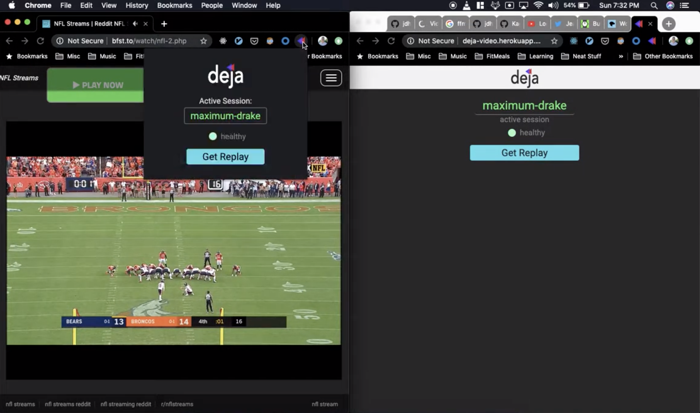
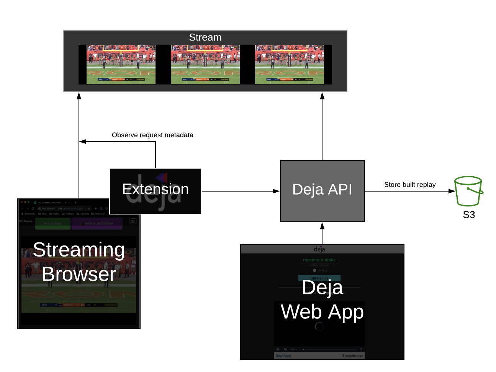

# Deja

### [Video Demo](https://www.youtube.com/watch?v=8sKslLUpeCs)

## What is deja?

Deja is a chrome extension ([link](https://chrome.google.com/webstore/detail/deja-extension/fadmeenbclggopfangnbjmfbleffocnb?hl=en-US) that lets you create "replays" from live streams (HLS). While watching a stream, you can use the Deja chrome extension to start a new "session" for that stream. At any point after, using that session you can create a replay of the last ~30 seconds of the stream either through the chrome extension, or also by pulling up the Deja web application for that session (which means this is possible from a browser window or even a mobile device).

## Why?

I was mainly motivated to create Deja because I enjoyed watching sports streams and wanted to be able to watch highlights again and save them for later. You can always rewind the playback to watch a part again, but that really interferes with the viewing experience and you can't shave that.

My ideal use of deja is starting the deja session on my laptop browser, hooking it up to my tv, and then pulling up the web app on my phone for when I want to make replays.

## How does it work?

There are 3 main parts to deja:

- [Chrome Extension](./extension): 2-3 sentence description + picture

- [API](./api): Simple description

- [Web App](./frontend): Sentence or two on what web app can do that extension cannot + picture
