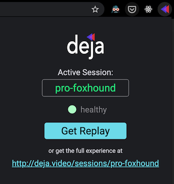
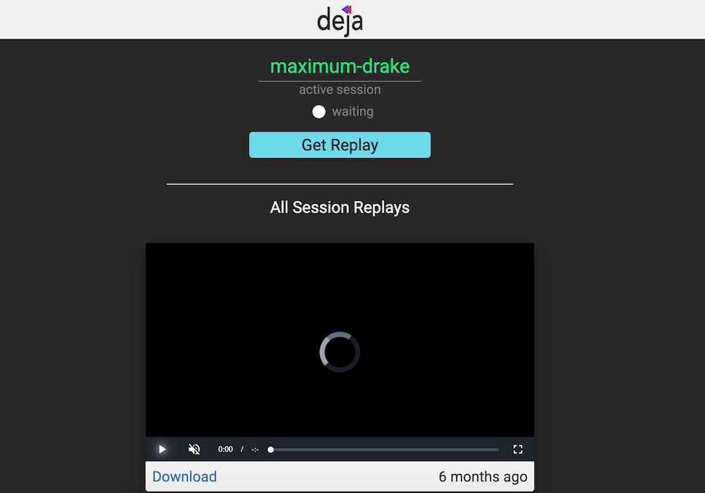

### [Video Demo](https://www.youtube.com/watch?v=8sKslLUpeCs)

## What is Deja?

Deja is a chrome extension ([link to chrome store](https://chrome.google.com/webstore/detail/deja-extension/fadmeenbclggopfangnbjmfbleffocnb?hl=en-US)) that lets you create "replays" from live streams ([specifically HLS streams](https://www.wikiwand.com/en/HTTP_Live_Streaming)). While watching a stream, you can use the Deja chrome extension to start a new "session" for that stream. At any point after, using that session you can create a replay of the last ~30 seconds of the stream either through the chrome extension, or also by pulling up the Deja web application for that session (which means this is possible from a browser window or even a mobile device).

## Why?

I was mainly motivated to create Deja because I enjoyed watching sports streams and wanted to be able to watch highlights again and save them for later. You can always rewind the playback to watch a part again, but that really interferes with the viewing experience and you can't save that.

My ideal use of deja is starting the deja session on my laptop browser, hooking it up to my tv, and then pulling up the web app on my phone for when I want to make replays.

## How does it work?

There are 3 main parts to Deja:

- [Chrome Extension](./extension): A simple Chrome extension with a lightweight React UI to allow users to begin sessions and request replays. Upon starting a session, the chrome extension begins observing network activity (it is only able to see the metadata i.e. request url, headers, etc). It starts a session with the API and begins reporting these requests so that, when requested, the API can construct a replay from the stream. Note: It was important in designing the architecture that the extension was built as un-invasive as possible, i.e. it would have been easier to simply override the XHR requests and evaluate the response bodies.

- [API](./api): Written in Go, this API is used to create sessions, record stream requests and build replays. When a replay is requested, it evaluates the past X `.m3u8` manifests for the stream, requests the segments and uses FFMPEG to construct a replay. This replay is stored in S3 and a link is sent to clients.

- [Web App](./frontend): (Hosted at [deja.video](deja.video)) A straightforward (somewhat mobile friendly) React web app that when given a session name, allows you to view the replays made so far as well as create new ones.

